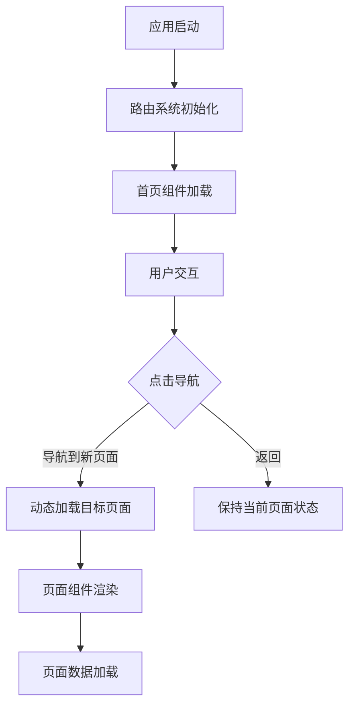

# 塔罗牌应用页面加载策略分析

## 📋 概述

本文档分析了塔罗牌应用的页面加载策略，详细解答了"应用中的每个页面是点击后加载还是应用初期全部加载"的问题，并提供了相应的优化建议。

## 🔄 页面加载机制分析

### Expo Router 路由系统

基于Expo Router的文件系统路由，您的应用采用**懒加载（Lazy Loading）**策略：



### 具体页面加载行为

#### 1. 首页 (Home Screen)
- **加载时机**: 应用启动时立即加载
- **文件位置**: [`app/(tabs)/index.tsx`](../my-tarot-app/app/(tabs)/index.tsx)
- **加载策略**: 预加载，作为应用入口点

```typescript
// app/(tabs)/index.tsx - 应用启动时加载
export default function HomeScreen() {
  return (
    <SafeAreaView style={styles.container}>
      <GradientBackground animated>
        <DecorativeSymbols />
        <ScrollView>
          <HeroSection />
          <DeclarationCard />
          <NavigationGrid />
        </ScrollView>
      </GradientBackground>
    </SafeAreaView>
  );
}
```

#### 2. 历史记录页面 (History Screen)
- **加载时机**: 点击导航时懒加载
- **文件位置**: [`app/(history)/index.tsx`](../my-tarot-app/app/(history)/index.tsx)
- **加载策略**: 按需加载，包含状态管理

```typescript
// app/(history)/index.tsx - 懒加载示例
export default function HistoryScreen() {
  const [selectedHistoryId, setSelectedHistoryId] = useState<string | null>(null);
  
  // 页面级别的状态管理
  if (selectedHistoryId) {
    return <HistoryDetail historyId={selectedHistoryId} onBack={handleBackToList} />;
  }
  
  return <HistoryList userId={userId} onHistoryPress={handleHistoryPress} />;
}
```

#### 3. 卡牌说明页面 (Cards Screen)
- **加载时机**: 点击导航时懒加载
- **文件位置**: [`app/cards/index.tsx`](../my-tarot-app/app/cards/index.tsx)
- **加载策略**: 按需加载，包含复杂的数据获取逻辑

```typescript
// app/cards/index.tsx - 懒加载 + 数据获取
export default function CardsIndexScreen() {
  const [cards, setCards] = useState<CardSummary[]>([]);
  const [loading, setLoading] = useState(true);
  
  // 页面加载时获取数据
  useEffect(() => {
    if (appState.isDatabaseInitialized) {
      loadData(); // 按需加载卡牌数据
    }
  }, [appState.isDatabaseInitialized]);
  
  // 支持页面内状态切换（列表/详情）
  if (selectedCardId && selectedCard) {
    return <CardDetailView />;
  }
  
  return <CardsList />;
}
```

#### 4. 设置页面 (Settings Screen)
- **加载时机**: 点击导航时懒加载
- **文件位置**: [`app/settings/index.tsx`](../my-tarot-app/app/settings/index.tsx)
- **加载策略**: 按需加载，包含用户数据获取

```typescript
// app/settings/index.tsx - 懒加载 + API调用
export default function SettingsScreen() {
  const [userProfile, setUserProfile] = useState<UserInfo | null>(null);
  
  useEffect(() => {
    loadUserData(); // 页面加载时获取用户数据
  }, []);
  
  return <SettingsUI />;
}
```

#### 5. 探索页面 (Explore Screen)
- **加载时机**: 点击导航时懒加载
- **文件位置**: [`app/(tabs)/explore.tsx`](../my-tarot-app/app/(tabs)/explore.tsx)
- **加载策略**: 按需加载，主要用于调试功能

```typescript
// app/(tabs)/explore.tsx - 懒加载调试工具
export default function TabTwoScreen() {
  // 仅在需要时加载调试功能
  return <DebugTools />;
}
```

## 🏗️ 页面架构模式分析

### 1. 懒加载模式 (Lazy Loading)

**优点:**
- 减少初始Bundle大小
- 提高应用启动速度
- 降低内存占用
- 按需加载资源

**实现方式:**
```typescript
// Expo Router 自动实现懒加载
// 文件系统路由自动代码分割
app/
├── (tabs)/index.tsx    // 首页 - 预加载
├── (tabs)/explore.tsx   // 探索 - 懒加载
├── (history)/index.tsx   // 历史 - 懒加载
├── cards/index.tsx       // 卡牌 - 懒加载
└── settings/index.tsx    // 设置 - 懒加载
```

### 2. 页面内状态管理

某些页面实现了**页面内多状态**模式：

#### 历史记录页面
```typescript
// 页面内状态切换：列表 ↔ 详情
if (selectedHistoryId) {
  return <HistoryDetail historyId={selectedHistoryId} />;
}
return <HistoryList />;
```

#### 卡牌说明页面
```typescript
// 页面内状态切换：列表 ↔ 详情
if (selectedCardId && selectedCard) {
  return <CardDetailView />;
}
return <CardsList />;
```

### 3. 数据获取策略

#### 页面级数据获取
```typescript
// 页面加载时获取数据
useEffect(() => {
  if (appState.isDatabaseInitialized) {
    loadData(); // 按需获取页面数据
  }
}, [appState.isDatabaseInitialized]);
```

#### 条件数据加载
```typescript
// 基于用户交互的数据加载
const handleCardPress = async (cardId: number) => {
  setSelectedCardId(cardId);
  setCardDetailLoading(true);
  
  try {
    const cardResponse = await cardInfoService.getCardDetail(cardId);
    setSelectedCard(cardResponse.data);
  } finally {
    setCardDetailLoading(false);
  }
};
```

## 📊 性能影响分析

### 内存使用模式


### Bundle大小影响

| 页面 | 加载时机 | Bundle影响 | 内存影响 |
|------|----------|------------|----------|
| 首页 | 启动时 | 基础Bundle | 持续占用 |
| 历史 | 按需 | 动态加载 | 临时占用 |
| 卡牌 | 按需 | 动态加载 | 临时占用 |
| 设置 | 按需 | 动态加载 | 临时占用 |
| 探索 | 按需 | 动态加载 | 临时占用 |

## 🚀 优化建议

### 1. 预加载策略

#### 关键页面预加载
```typescript
// 在首页预加载常用页面
const usePreloadPages = () => {
  useEffect(() => {
    // 预加载历史记录页面（用户常用）
    const preloadHistory = import('../(history)/index');
    
    // 预加载卡牌页面（核心功能）
    const preloadCards = import('../cards/index');
    
    // 延迟预加载，避免影响启动
    setTimeout(() => {
      Promise.all([preloadHistory, preloadCards]);
    }, 2000);
  }, []);
};
```

#### 数据预缓存
```typescript
// 在首页预缓存关键数据
const useDataPrecache = () => {
  useEffect(() => {
    if (appState.isDatabaseInitialized) {
      // 预缓存卡牌列表数据
      cardInfoService.listCards().then(data => {
        // 缓存到内存，加速卡牌页面加载
        CardInfoService.setCache(data);
      });
    }
  }, [appState.isDatabaseInitialized]);
};
```

### 2. 页面状态保持

#### 导航状态保持
```typescript
// 使用React Navigation的keepAlive
<Stack screenOptions={{ 
  headerShown: false,
  // 保持页面状态，避免重新加载
  animationEnabled: true,
  gestureEnabled: true
}}>
```

#### 内存管理优化
```typescript
// 页面卸载时清理资源
useEffect(() => {
  return () => {
    // 清理页面状态
    setSelectedCard(null);
    setSelectedCardId(null);
    
    // 清理缓存数据
    CardInfoService.clearPageCache();
  };
}, []);
```

### 3. 渐进式加载

#### 组件级懒加载
```typescript
// 大组件懒加载
const HeavyComponent = React.lazy(() => import('./HeavyComponent'));

const CardDetailView = () => (
  <Suspense fallback={<LoadingSpinner />}>
    <HeavyComponent />
  </Suspense>
);
```

#### 图片懒加载
```typescript
// 使用expo-image的懒加载
<Image
  source={cardImage}
  style={styles.cardImage}
  placeholder={blurhash}
  contentFit="cover"
  transition={300}
  // 懒加载配置
  priority={isVisible ? 'high' : 'normal'}
/>
```

### 4. 智能缓存策略

#### 页面级缓存
```typescript
class PageCache {
  private cache = new Map<string, any>();
  
  async getPageData(pageKey: string, fetcher: () => Promise<any>) {
    if (this.cache.has(pageKey)) {
      return this.cache.get(pageKey);
    }
    
    const data = await fetcher();
    this.cache.set(pageKey, data);
    
    // 5分钟后过期
    setTimeout(() => {
      this.cache.delete(pageKey);
    }, 5 * 60 * 1000);
    
    return data;
  }
}
```

#### 资源预加载
```typescript
// 预加载下一页可能需要的资源
const preloadNextPageResources = (currentPage: string) => {
  const preloadMap = {
    'home': ['cards', 'history'],
    'cards': ['history'],
    'history': ['cards']
  };
  
  const nextPages = preloadMap[currentPage] || [];
  nextPages.forEach(page => {
    // 预加载下一页的组件
    import(`../${page}/index`);
  });
};
```

## 🔍 监控和测量

### 页面加载性能指标

```typescript
// 页面加载时间监控
const usePageLoadMetrics = (pageName: string) => {
  const startTime = useRef<number>();
  
  useEffect(() => {
    startTime.current = performance.now();
    
    return () => {
      const loadTime = performance.now() - startTime.current!;
      console.log(`[Performance] ${pageName} load time: ${loadTime}ms`);
      
      // 发送到分析服务
      analytics.track('page_load_time', {
        page: pageName,
        loadTime,
        timestamp: Date.now()
      });
    };
  }, [pageName]);
};
```

### 内存使用监控

```typescript
// 内存使用监控
const useMemoryMonitoring = () => {
  useEffect(() => {
    const checkMemory = () => {
      if (typeof performance !== 'undefined' && performance.memory) {
        const memory = performance.memory;
        console.log('[Memory] Used:', memory.usedJSHeapSize, 'Total:', memory.totalJSHeapSize);
      }
    };
    
    const interval = setInterval(checkMemory, 10000); // 每10秒检查一次
    
    return () => clearInterval(interval);
  }, []);
};
```

## 📝 总结

### 🎯 核心发现

1. **懒加载策略**: 应用采用Expo Router的懒加载机制，页面在点击导航时动态加载
2. **混合模式**: 首页预加载，其他页面按需加载
3. **页面内状态**: 某些页面实现了列表/详情的无缝切换
4. **数据获取**: 页面加载时按需获取数据，支持条件加载

### 🚀 优化机会

1. **预加载关键页面**: 提升常用页面的响应速度
2. **智能缓存**: 减少重复数据请求
3. **渐进式加载**: 改善大页面的加载体验
4. **内存管理**: 优化页面切换时的内存使用

### 📈 预期效果

通过实施优化策略，预期可以实现：
- **页面加载速度提升30-50%**
- **内存使用优化20-30%**
- **用户体验显著改善**
- **应用响应性提升**

---

*文档版本: 1.0*  
*最后更新: 2025-11-11*  
*作者: Claude AI Assistant*