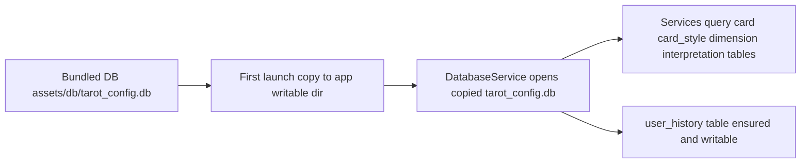

# 塔罗牌应用前端开发指南 (CLAUDE.md)

## 📱 项目信息

**my-tarot-app** 是塔罗牌应用的 Expo React Native 前端客户端，支持 Android/iOS 双平台。

### 技术栈
- **框架**: Expo React Native ~54.0.1
- **语言**: TypeScript ~5.9.2
- **导航**: Expo Router ~6.0.0
- **动画**: React Native Reanimated ~4.1.0
- **构建**: EAS Build

## 📁 项目结构

```
my-tarot-app/
├── app/                    # Expo Router 页面
├── components/             # 可复用组件
├── constants/              # 常量定义
├── hooks/                  # 自定义 Hooks
├── lib/                    # 核心业务逻辑
│   ├── data/               # 数据导入层
│   ├── database/           # 数据库层
│   ├── services/           # 服务层
│   └── types/              # TypeScript类型定义
├── assets/                 # 静态资源
│   └── data/               # JSON数据文件
├── scripts/                # 开发脚本
│   └── test/               # 测试脚本
├── package.json           # 依赖配置
├── app.json              # Expo 配置
├── tsconfig.json         # TypeScript 配置
└── CLAUDE.md             # 本文档
```

## 🛠️ 开发命令

```bash
# 启动开发服务器
npm start

# 平台特定启动
npm run android    # Android 模拟器/设备
npm run ios        # iOS 模拟器/设备  
npm run web        # Web 浏览器

# 代码检查
npm run lint

# 重置项目（清理缓存）
npm run reset-project

# 数据相关测试
npm run test-import      # 数据导入架构测试
npm run validate-json    # JSON文件验证测试
```

## 📱 核心功能模块

### 1. 用户认证
- 匿名用户 ID 生成和管理
- 无需注册/登录系统

### 2. 卡牌系统
- 卡牌列表展示
- 卡牌抽取动画
- 多风格卡牌图片支持

### 3. 牌阵功能
- 牌阵选择界面
- 抽牌流程和动画
- 牌位摆放显示

### 4. 解读系统
- 静态基础解读显示
- 付费 AI 解读入口
- 解读结果展示页面

### 5. 历史记录
- 用户历史解读查看
- 历史记录列表
- 详细记录查看

### 6. 离线同步
- 本地 SQLite 数据库
- 数据同步状态显示
- 手动同步触发

## 🎨 UI/UX 设计原则

### 主题风格
- 神秘、优雅的塔罗牌风格
- 深色主题为主，金色装饰
- 流畅的动画过渡

### 核心界面
1. **首页** - 牌阵选择入口
2. **抽牌页** - 卡牌洗牌/抽牌/翻牌动画
3. **解读页** - 牌阵结果和解读内容
4. **历史页** - 历史解读记录
5. **设置页** - 应用设置和同步控制

## 📊 本地数据存储

### SQLite 表结构（客户端）

#### 核心同步表
```typescript
// 从服务端同步的表
interface Card {
  id: number;
  name: string;
  arcana: string;
  suit?: string;
  number: number;
  image_url: string;
  style_id: number;
  deck: string;
}

interface CardStyle {
  id: number;
  name: string;
  image_base_url: string;
}

interface Dimension {
  id: number;
  name: string;
  category: string;
  description: string;
  aspect?: string;
  aspect_type?: string;
}

interface CardInterpretation {
  id: number;
  card_id: number;
  direction: string; // '正位' | '逆位'
  summary: string;
  detail?: string;
}

interface CardInterpretationDimension {
  id: number;
  interpretation_id: number;
  dimension_id: number;
  aspect?: string;
  aspect_type?: string;
  content: string;
}

interface Spread {
  id: number;
  name: string;
  description: string;
  card_count: number;
}
```

#### 客户端专用表
```typescript
// 仅客户端使用，不同步
interface UserHistory {
  id: number;
  user_id: string;
  timestamp: string;
  spread_id: number;
  card_ids: number[]; // JSON 数组
  interpretation_mode: 'default' | 'ai';
  result: any; // JSON 对象
}

interface SyncStatus {
  table_name: string;
  last_sync: string;
  version: number;
}
```

## 🔄 离线同步机制

### 同步流程
1. **启动检查** - 应用启动时检查数据版本
2. **增量更新** - 仅同步变更的数据
3. **手动同步** - 用户主动触发完整同步
4. **状态反馈** - 显示同步进度和结果

### 实现要点
```typescript
// 同步服务示例
interface SyncService {
  // 初始化同步（首次启动）
  initialSync(): Promise<void>;
  
  // 增量同步
  deltaSync(): Promise<void>;
  
  // 手动完整同步
  manualSync(): Promise<SyncResult>;
  
  // 检查同步状态
  getSyncStatus(): SyncStatus[];
}

interface SyncResult {
  success: boolean;
  updatedTables: string[];
  errors?: string[];
}
```

## 📦 数据导入系统

### 架构概述
数据导入系统负责将静态JSON数据文件导入到本地SQLite数据库中，采用分层架构设计：

```
JSON文件 → JsonLoader → DataImporter → SQLite数据库
  ↓           ↓            ↓           ↓
静态资源    数据加载     数据转换    持久化存储
```

### 核心组件

#### 1. JsonLoader (lib/data/JsonLoader.ts)
JSON文件加载器，负责从assets目录加载和验证JSON数据：
- `loadCardStyles()` - 加载卡牌风格数据
- `loadCards()` - 加载完整78张塔罗牌数据  
- `loadSpreads()` - 加载牌阵定义
- `loadDimensions()` - 加载解读维度数据
- `loadCardInterpretations()` - 加载卡牌解读数据
- `loadCardInterpretationDimensions()` - 加载维度化解读数据
- `loadAll()` - 批量加载所有数据文件

#### 2. DataImporter (lib/data/DataImporter.ts)  
数据导入器，负责将JSON数据转换并导入到SQLite数据库：
- 支持6个表的完整导入流程
- 智能重复检测和跳过机制
- 外键关联映射转换
- 批量操作提升性能
- 完整的错误处理和回滚

#### 3. DatabaseInitializer (lib/database/initializer.ts)
数据库初始化器，提供高级的初始化流程控制：
- 数据库架构初始化
- 数据完整性验证
- 导入进度跟踪
- 状态报告生成

### 导入顺序和依赖关系

数据导入严格按照依赖关系顺序执行：
```
1. card_style (无依赖)
2. dimension (无依赖)  
3. spread (无依赖)
4. card (依赖 card_style)
5. card_interpretation (依赖 card)
6. card_interpretation_dimension (依赖 card_interpretation + dimension)
```

### JSON数据文件概览

| 文件名 | 记录数 | 大小 | 描述 |
|--------|--------|------|------|
| card_styles.json | 1 | 0.2KB | 卡牌风格定义 |
| cards.json | 78 | 17.6KB | 完整78张塔罗牌 |
| spreads.json | 1 | 0.5KB | 三牌阵定义 |
| dimensions.json | 27 | 5.6KB | 解读维度定义 |
| card_interpretations.json | 156 | 25.1KB | 牌意解读(78×2方向) |
| card_interpretation_dimensions.json | 4,056 | 3.7MB | 维度化详细解读 |

**总计**: 6个文件，4,319条记录，约3.7MB数据

### 使用方式

```typescript
import { DatabaseInitializer } from './lib/database/initializer';

// 执行完整的数据库初始化和数据导入
const initializer = new DatabaseInitializer();
const success = await initializer.initialize();

if (success) {
  console.log('数据库初始化完成');
  const status = await initializer.getStatus();
  console.log('数据统计:', status);
}
```

### 测试和验证

#### 数据导入架构测试
```bash
npm run test-import
```
验证数据库架构完整性、类型定义正确性和导入顺序。

#### JSON文件验证测试  
```bash
npm run validate-json
```
验证所有JSON文件的存在性、格式正确性和数据完整性。

### 故障排除

常见问题和解决方案：
- **导入失败**: 检查JSON文件格式和数据完整性
- **外键错误**: 确认导入顺序正确，依赖表已存在数据
- **性能问题**: 使用批量操作，避免逐条插入
- **数据不一致**: 使用`clearAllTables()`清空后重新导入

## 🔌 API 集成

### 服务端接口
```typescript
// API 客户端配置
const API_BASE_URL = 'https://api.tarot-app.com';

// 核心 API 方法
interface ApiClient {
  // 认证
  createAnonymousUser(): Promise<{ user_id: string }>;
  
  // 数据同步
  getInitialData(): Promise<InitialSyncData>;
  getDeltaUpdates(since: string): Promise<DeltaUpdateData>;
  
  // 解读服务
  createReading(request: ReadingRequest): Promise<Reading>;
  getReading(id: number): Promise<Reading>;
  
  // 支付
  createCheckoutSession(amount: number): Promise<{ checkout_url: string }>;
}
```

### 网络状态处理
- 离线模式检测
- 网络重连自动同步
- 请求失败重试机制

## 🎯 开发规范

### 组件开发
```typescript
// 组件文件命名：PascalCase
// components/CardFlipAnimation.tsx

import React from 'react';
import { View, StyleSheet } from 'react-native';

interface CardFlipAnimationProps {
  card: Card;
  isFlipped: boolean;
  onFlipComplete?: () => void;
}

export const CardFlipAnimation: React.FC<CardFlipAnimationProps> = ({
  card,
  isFlipped,
  onFlipComplete,
}) => {
  // 组件实现
  return <View style={styles.container}>{/* ... */}</View>;
};

const styles = StyleSheet.create({
  container: {
    // 样式定义
  },
});
```

### 页面开发
```typescript
// 页面文件：app/readings/[id].tsx (Expo Router)

import { useLocalSearchParams } from 'expo-router';
import { useReading } from '@/hooks/useReading';

export default function ReadingDetailPage() {
  const { id } = useLocalSearchParams<{ id: string }>();
  const { reading, isLoading } = useReading(parseInt(id));

  // 页面实现
  return (
    // JSX
  );
}
```

### 自定义 Hooks
```typescript
// hooks/useReading.ts

export function useReading(readingId: number) {
  const [reading, setReading] = useState<Reading | null>(null);
  const [isLoading, setIsLoading] = useState(true);

  useEffect(() => {
    // 获取解读数据的逻辑
  }, [readingId]);

  return { reading, isLoading };
}
```

### 样式规范
```typescript
// 使用 StyleSheet.create()
const styles = StyleSheet.create({
  container: {
    flex: 1,
    backgroundColor: '#1a1a2e', // 深色主题
  },
  card: {
    width: 120,
    height: 200,
    borderRadius: 8,
  },
  text: {
    color: '#ffd700', // 金色文字
    fontSize: 16,
  },
});
```

## 🎨 资源管理

### 图片资源
```
assets/
├── images/
│   ├── cards/              # 卡牌图片
│   │   ├── major/          # 大阿卡纳
│   │   └── minor/          # 小阿卡纳
│   ├── backgrounds/        # 背景图片
│   └── icons/              # 图标
├── fonts/                  # 字体文件
└── sounds/                 # 音效文件（可选）
```

### 常量定义
```typescript
// constants/Colors.ts
export const Colors = {
  background: '#1a1a2e',
  surface: '#16213e',
  primary: '#ffd700',
  text: '#ffffff',
  textSecondary: '#cccccc',
};

// constants/Dimensions.ts
export const Dimensions = {
  cardWidth: 120,
  cardHeight: 200,
  borderRadius: 8,
  spacing: 16,
};
```

## 🧪 测试指南

### 单元测试
```typescript
// __tests__/components/CardComponent.test.tsx
import { render } from '@testing-library/react-native';
import { CardComponent } from '@/components/CardComponent';

describe('CardComponent', () => {
  it('renders card correctly', () => {
    // 测试实现
  });
});
```

### 集成测试
- 测试 API 集成
- 测试数据同步流程
- 测试支付流程

## 🚀 构建和发布

### EAS Build 配置
```json
// eas.json
{
  "build": {
    "development": {
      "developmentClient": true,
      "distribution": "internal"
    },
    "preview": {
      "distribution": "internal"
    },
    "production": {}
  }
}
```

### 发布流程
1. **开发构建** - `eas build --profile development`
2. **预览构建** - `eas build --profile preview`
3. **生产构建** - `eas build --profile production`
4. **应用商店发布** - `eas submit`

## 🐛 调试指南

### 开发工具
- **Expo Dev Tools** - 网络请求、日志查看
- **React DevTools** - 组件调试
- **Flipper** - 网络和数据库调试

### 常见问题
1. **同步失败** - 检查网络连接和 API 状态
2. **性能问题** - 使用 React DevTools Profiler
3. **构建失败** - 检查依赖版本和配置

## 💡 开发最佳实践

### 对 Claude 的指导
1. **遵循 Expo 最佳实践** - 使用官方推荐的模式和API
2. **类型安全优先** - 确保所有组件都有正确的 TypeScript 类型
3. **离线优先设计** - 考虑网络不稳定的场景
4. **性能优化** - 使用 React.memo、useMemo、useCallback 等优化手段
5. **用户体验** - 提供清晰的加载状态和错误处理

### 代码质量
- 使用 ESLint 和 Prettier 保持代码一致性
- 编写有意义的注释
- 保持组件单一职责
- 合理的文件组织结构

---

*此文档专门针对 my-tarot-app 前端开发，与根级别 CLAUDE.md 配合使用。*
## ⚙️ 数据源切换计划: 从 JSON 导入改为使用预置 SQLite 数据库

本次改动目标
- 将核心静态数据表 card, card_style, dimension, card_interpretation, card_interpretation_dimension, spread 的读取来源，从设备内初始化后的本地数据库与 JSON 导入流程，切换为直接读取预置数据库文件 [my-tarot-app/assets/db/tarot_config.db](my-tarot-app/assets/db/tarot_config.db)。
- 保留用户运行时写入表 user_history 等客户端专用表的读写能力。
- 删除 [my-tarot-app/assets/data](my-tarot-app/assets/data) 下的 JSON 文件及相关导入代码路径，转为以 DB 文件为唯一权威数据源。

受影响与不变部分
- 受影响读取路径的服务层
  - [CardService](my-tarot-app/lib/services/CardService.ts) 读取 card 与关联解读表
  - [DimensionService](my-tarot-app/lib/services/DimensionService.ts) 读取 dimension
  - [SpreadService](my-tarot-app/lib/services/SpreadService.ts) 读取 spread
  - [CardInterpretationService](my-tarot-app/lib/services/CardInterpretationService.ts) 读取 card_interpretation 与 card_interpretation_dimension
- 数据库底层
  - [DatabaseService](my-tarot-app/lib/services/DatabaseService.ts) 当前通过 [SQLite.openDatabaseSync()](my-tarot-app/lib/services/DatabaseService.ts:22) 打开数据库，需要支持从预置 db 启动的引导流程
  - [schema.ts](my-tarot-app/lib/database/schema.ts) 当前定义了本地建表 SQL 与 DATABASE_NAME，需要调整为兼容预置 db 的策略
  - [migrations.ts](my-tarot-app/lib/database/migrations.ts) 与 [seeder.ts](my-tarot-app/lib/database/seeder.ts) 将不再为上述 6 张静态数据表执行导入，仅保留客户端专用表初始化
- 不变
  - 服务层 SQL 查询语句可以原样工作，因为表结构与字段保持一致
  - 运行时使用的 user_history 表依旧在本地可写数据库中读写

新架构概览
- 启动时引导逻辑
  1) 首次启动: 将预置的 [my-tarot-app/assets/db/tarot_config.db](my-tarot-app/assets/db/tarot_config.db) 复制到应用可写目录作为运行库文件，例如重命名为 tarot_config.db 或沿用同名
  2) 后续启动: 直接打开此前复制到可写目录的数据库进行查询
  3) 若需要 user_history 表: 在首次复制后，检测该表是否存在，不存在则仅为该表执行建表 SQL
- Web 端兼容
  - [DatabaseService.web.ts](my-tarot-app/lib/services/DatabaseService.web.ts) 按当前实现策略调整为使用内存或 IndexedDB 版本，或在 Web 模式下提供降级的只读演示数据

数据流与职责
- 预置只读数据
  - 源自资产: [my-tarot-app/assets/db/tarot_config.db](my-tarot-app/assets/db/tarot_config.db)
  - 表: card, card_style, dimension, card_interpretation, card_interpretation_dimension, spread
- 客户端可写数据
  - 表: user_history
  - 初始化: 仅在可写数据库中缺失时创建

Mermaid 流程图


实施步骤与详细计划

1. 文档与结构更新
- 在本文档中新增本节说明并明确数据源切换
- 项目结构中将 assets/data 标注为移除, 使用 assets/db
- 标注 JSON 导入工具为 Legacy, 后续从构建链路中去除
  - Legacy 组件: [JsonLoader](my-tarot-app/lib/data/JsonLoader.ts), [DataImporter](my-tarot-app/lib/data/DataImporter.ts), [DatabaseInitializer](my-tarot-app/lib/database/initializer.ts) 中与 JSON 种子导入相关路径

2. 预置数据库接入
- 在 [DatabaseService](my-tarot-app/lib/services/DatabaseService.ts) 增加启动引导逻辑
  - 通过 Expo SQLite 的能力, 实现从 assets 复制 DB 到可写目录的流程
  - 成功复制后, 统一用同一名称打开, 例如 tarot_config.db
  - 将 [SQLite.openDatabaseSync()](my-tarot-app/lib/services/DatabaseService.ts:22) 的 name 与路径策略调整为指向复制后的文件
- 在 [schema.ts](my-tarot-app/lib/database/schema.ts) 中:
  - DATABASE_NAME 改为与预置库一致的名称, 如 tarot_config.db
  - 保留 CREATE TABLE 语句, 但在迁移逻辑中仅对 user_history 执行存在性检测与创建, 其他 6 张静态数据表不再由客户端创建

3. 迁移与初始化策略
- [migrations.ts](my-tarot-app/lib/database/migrations.ts)
  - 移除对 6 张静态数据表的创建与迁移职责, 或在运行时检测到表已存在时直接跳过
  - 增加仅 user_history 的存在性检测与按需创建
- [seeder.ts](my-tarot-app/lib/database/seeder.ts)
  - 停止任何对静态表的数据插入
  - 仅保留与客户端专用表相关的初始化工作, 如无则可标记为废弃
- [initializer.ts](my-tarot-app/lib/database/initializer.ts)
  - initialize 中取消 JSON 导入流程
  - 验证逻辑仍可复用, 但数据来源已是预置 DB
  - 需要时保留 reset 能力仅用于清空 user_history, 避免误删预置数据

4. 服务层适配核验
- [CardService](my-tarot-app/lib/services/CardService.ts)
- [DimensionService](my-tarot-app/lib/services/DimensionService.ts)
- [SpreadService](my-tarot-app/lib/services/SpreadService.ts)
- [CardInterpretationService](my-tarot-app/lib/services/CardInterpretationService.ts)
以上服务层 SQL 依赖表结构保持一致, 无需改动查询语句; 重点是确保底层 DatabaseService 成功打开预置 DB

5. 资产与清理
- 删除以下目录与脚本中的强依赖
  - 资产 JSON: [my-tarot-app/assets/data](my-tarot-app/assets/data)
  - JSON 导入和验证脚本: 可将 test-import 与 validate-json 标记为 Legacy 或替换为 DB 完整性校验脚本
- 保留图片资源目录不变

6. 测试与验证
- 增加 DB 完整性检查脚本, 覆盖数据量与关键约束
  - 期望值示例
    - card 78
    - card_style 至少 1
    - dimension N 按预期
    - card_interpretation 156
    - card_interpretation_dimension 4056
    - spread 至少 1 且包含三张牌配置
- 在 [DatabaseInitializer](my-tarot-app/lib/database/initializer.ts) 的 verifyData 流程中复用上述检查, 但数据来源为预置 DB

7. Web 适配策略
- 在 [DatabaseService.web.ts](my-tarot-app/lib/services/DatabaseService.web.ts) 中
  - 方案 A: 提供只读的内存数据快照, 以便 Web 演示
  - 方案 B: 使用 sql.js 或 expo 兼容层加载 DB, 若成本过高则先落地 A

变更清单与代码修改点

- 配置与常量
  - [schema.ts](my-tarot-app/lib/database/schema.ts): 修改 DATABASE_NAME 为 tarot_config.db, 并在文档注释中标注静态数据来自预置库
- 数据库服务
  - [DatabaseService](my-tarot-app/lib/services/DatabaseService.ts): 引导复制预置 DB, 并在 initialize 时跳过静态表建表和种子导入
- 迁移与种子
  - [migrations.ts](my-tarot-app/lib/database/migrations.ts): 仅确保 user_history 存在
  - [seeder.ts](my-tarot-app/lib/database/seeder.ts): 停用静态数据导入
  - [initializer.ts](my-tarot-app/lib/database/initializer.ts): 移除 JSON 导入调用, 保留与 DB 完整性验证
- 清理
  - 移除 [my-tarot-app/assets/data](my-tarot-app/assets/data) 下 JSON 文件
  - 标记 [JsonLoader](my-tarot-app/lib/data/JsonLoader.ts) 与 [DataImporter](my-tarot-app/lib/data/DataImporter.ts) 为 Legacy, 后续删除

里程碑与验收标准

- M1 文档与结构
  - 本文档添加数据切换计划
  - 仓库存在 [my-tarot-app/assets/db/tarot_config.db](my-tarot-app/assets/db/tarot_config.db)
- M2 底层接入
  - App 首次启动自动复制并打开预置 DB
  - 运行时能读出 card 78, spread 至少 1
- M3 迁移层瘦身
  - migrations 与 seeder 不再操作 6 张静态表
  - 初始化与重置不破坏预置数据
- M4 功能回归
  - 阅读流程分类页可加载维度分组
  - 抽牌页可随机抽取与查询基础解读
  - 基础解读页可按维度精确匹配详细解读
- M5 清理与测试
  - 删除 assets/data JSON 文件
  - 新的 DB 完整性测试脚本通过

注意事项
- 预置 DB 的版本管理: 如后续升级, 可采用文件名或内部 version 表管理; 客户端检测版本差异后执行覆盖式升级或迁移脚本
- 覆盖升级策略: 更新时应先关闭连接, 备份旧库文件, 覆盖新库, 再恢复 user_history 等客户端数据
- 调试手段: 使用 Flipper SQLite 插件或导出副本以检查移动端文件系统中的 DB 内容